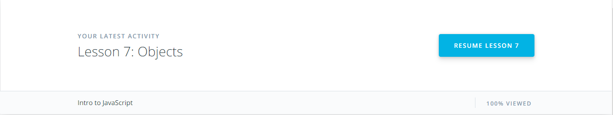

## Git and GitHub Intro 

I've already known about Git and GitHub, but I haven't payed attention to it. It was a big mistake because now I understand that it is a great tool for development as it helps you not to be afraid of breaking something in your project. Moreveover, GitHub gives you a great opportunity to collaborate with other developers.

The course on Udacity was good and I really enjoyed try.github.io.

## Linux, CLI and HTTP

In this task I've learned some new things about CLI such as redirection of output, input and how to configure your own environment in CLI. Moreover, HTTP was a new thing for me. Now I know a little bit about how browser communicates with other machines on the Internet.

## Git Collaboration

This course was interesting for me. I've learned new things in Git. I really liked the `--oneline` flag for `git log` command. Also it is really good that it was explained how to undo your commits. I think `git commit --amend` and `git reset` are frequently used in practice.

It was really useful to complete this course because I refreshed my knowledge of GitHub and I got a better understanding of it. Moreover, this course explains greatly how to contribute in open-source projects.

## Intro to HTML and CSS

This course was as a little refresher of my knowledge. Everything wasn't new for me except some things about selectors. For example, I didn't know about `:nth-child` selector. 

This course was a little bit boring for me because almost everything that was in this course I've already known, but I've learned some new things about cascading and inheritance.

## Responsive Web Design

In this course I've learned about flexbox and different design patterns of responsive websites. I think flexbox is a great tool and I was surprised that you can just change the order of elements in the flexbox with the `order` property in css.

This game is awesome and it was useful for me because now I know about css properties for flexbox such as
* `justify-content`
* `align-items`
* `flex-direction`
* `align-self`
* `flex-flow`
* `align-content`

## JS Basics

At the beginning of this course everything was very easy because I've already known everythin, but in the middle of the course I've started to learn about new things in JavaScript such as `forEach()` method for arrays, hoisting of declarations, functions as parameters, named function expressions and inline function expressions. Also, now I know about such array methods as: `map()`, `splice()`, `pop()`, `push()` and others. Moreover, I've learned how objects are presented in JavaScript.

This exercises were useful for me because I've learned how to manipulate strings in JavaScript.

Also in this task I've learned about some basic algorithms and how linked list, graphs, queue and stack are represented in JavaScript.